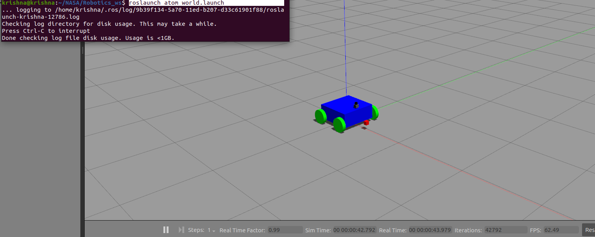

# Atom Robot - sensor_fusion
sensor fusion project workspace

## Set up workspace
```bash
git clone https://github.com/chaitanyantr/atom_sensor_fusion.git
cd atom_sensor_fusion
catkin_make
source devel/setup.sh
```


## Atom Robot
```bash
roslaunch atom world.launch
```


